# NeuroBand Code Architecture

The diagram below describes the executable code structure after consolidation.
It separates hardware integration, acquisition, machine learning, applications,
and generated artifacts so each module has one primary responsibility.

```mermaid
flowchart LR
    subgraph RT["Realtime data path"]
        SENSORS["3 x uMyo sensors<br/>Hardware"] --> OEM["OEM parser<br/>umyo_parser.py"] --> STREAM["Acquisition<br/>umyo_stream.py"]
        STREAM --> SYNC["Window synchronization<br/>realtime_gesture_gui.py"] --> PRE["Preprocessing<br/>classifier_adapter.py"]
        PRE --> ADAPTER["Inference + decision<br/>classifier_adapter.py + DecisionSmoother"] --> GUI["Realtime GUI<br/>realtime_gesture_gui.py"]
        GUI --> MOUSE["Windows mouse<br/>mouse_game_control.py"]
        GUI --> GAME["Target game<br/>neuroband_shooter.py"]
    end

    subgraph TRAIN["Personal training path"]
        RECORDING["Calibration recording<br/>Data artifact"] --> QUALITY["Quality audit<br/>recording_quality_gate.py"]
        QUALITY --> PIPELINE["Training pipeline<br/>training_data_pipeline.py"] --> PRIMITIVES["Model primitives<br/>model_training.py"]
        PRIMITIVES --> PERSONAL["Personal training<br/>personal_stage_training.py"] --> MODEL["Personal model artifact<br/>Generated .pkl"]
    end

    subgraph EVAL["Evaluation and adaptation path"]
        REPLAY["Chronological replay<br/>replay_evaluation.py"] --> DECISIONS["Decision comparison<br/>replay_evaluation.py"] --> REPORTS["Evaluation reports<br/>Generated output"]
        CURRENT["Short current session<br/>Data artifact"] --> UPDATE["Short recalibration<br/>update_personal_model.py"]
    end

    STREAM -->|record synchronized samples| RECORDING
    GUI -.->|guided protocol labels| RECORDING
    MODEL -->|load selected model| ADAPTER
    RECORDING -->|replay data| REPLAY
    MODEL -.->|selected model for replay| REPLAY
    MODEL -->|base model| UPDATE
    UPDATE -.->|validated updated artifact| MODEL
```

## Block-To-Code Traceability

| Architecture block | Implementation owner | Type |
| --- | --- | --- |
| 3 x uMyo sensors | Physical uMyo devices | Hardware/data source |
| OEM packet parser | `OEM_files/umyo_parser.py`, `umyo_class.py`, `quat_math.py` | OEM code |
| Acquisition | `NeuroBand_files/umyo_stream.py`, `UmyoSerialReader` | Project code |
| Window synchronization | `NeuroBand_files/realtime_gesture_gui.py`, `ThreeSensorEmgPanel.classifier_window()` | Project code |
| Realtime preprocessing | `NeuroBand_files/classifier_adapter.py`, `FeatureExtractor` | Project code |
| Inference and temporal decision | `classifier_adapter.py`, plus `DecisionSmoother` in `realtime_gesture_gui.py` | Project code |
| Realtime GUI | `NeuroBand_files/realtime_gesture_gui.py`, `RealtimeGestureGui` | Project code |
| Windows mouse | `NeuroBand_files/mouse_game_control.py` | Project code |
| Target game | `NeuroBand_files/neuroband_shooter.py` | Project code |
| Calibration recording | Written by the calibration workflow in `realtime_gesture_gui.py` | Data artifact |
| Quality audit | `NeuroBand_files/recording_quality_gate.py` | Project code |
| Training data pipeline | `NeuroBand_files/training_data_pipeline.py`, especially `extract_fused_windows()` | Project code |
| Model primitives | `NeuroBand_files/model_training.py` | Project code |
| Personal training | `NeuroBand_files/personal_stage_training.py`, `run_training()` | Project code |
| Personal model artifact | `.pkl` generated by `personal_stage_training.py` | Model artifact |
| Chronological replay | `NeuroBand_files/replay_evaluation.py`, `run_replay()` | Project code |
| Decision comparison | `replay_evaluation.py`, `compare_decision_strategies()` | Project code |
| Evaluation reports | Files generated by `replay_evaluation.py` | Generated output |
| Short current session | Written by the GUI recalibration workflow | Data artifact |
| Short recalibration | `NeuroBand_files/update_personal_model.py` | Project code |

## Runtime Path

`run_realtime_gui.py` creates the PySide6 application and starts
`realtime_gesture_gui.py`. The GUI owns the serial reader, receives immutable
device snapshots from `umyo_stream.py`, updates lightweight EMG plots, and sends
synchronized sensor windows to `classifier_adapter.py`. The adapter applies the
preprocessing contract stored in the selected model artifact and returns class
probabilities. The GUI then applies confidence rejection and the selected temporal
decision mechanism before exposing a stable gesture to mouse or application logic.

## Training Path

Calibration recordings are written under `Data/calibration_sessions`. The quality
gate annotates packet gaps, signal noise, clipping, and sensor availability.
`training_data_pipeline.py` loads valid rows, applies filtering and normalization,
forms overlapping windows, and fuses all three sensor locations. Shared feature,
model, probability, and threshold functions live in `model_training.py`.
`personal_stage_training.py` performs leakage-safe train/validation/held-out-test
selection, chooses the Full Grid winner on validation data, refits the selected
configuration, and writes a self-contained personal model artifact.

## Evaluation Path

`replay_evaluation.py` replays a labeled recording in chronological order using
the same window construction and preprocessing contract as realtime inference.
It writes predictions and metrics, then compares raw, confidence-threshold,
majority, consecutive-window, and hysteresis decisions. This separation keeps
classifier quality and temporal-control behavior measurable independently.

## Application Boundaries

- `mouse_game_control.py` converts stabilized EMG commands and dorsal-forearm IMU
  orientation into Windows cursor, click, drag, and scroll actions.
- `neuroband_shooter.py` is a separate end application that reuses acquisition and
  classification without embedding game code inside the medical-signal GUI.
- `recording_quality_gate.py` is shared by calibration and training but does not
  stop realtime classification on every transient quality warning.
- OEM parser files remain isolated and unmodified so project code can be reviewed
  independently from vendor code.
